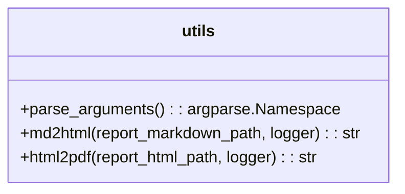
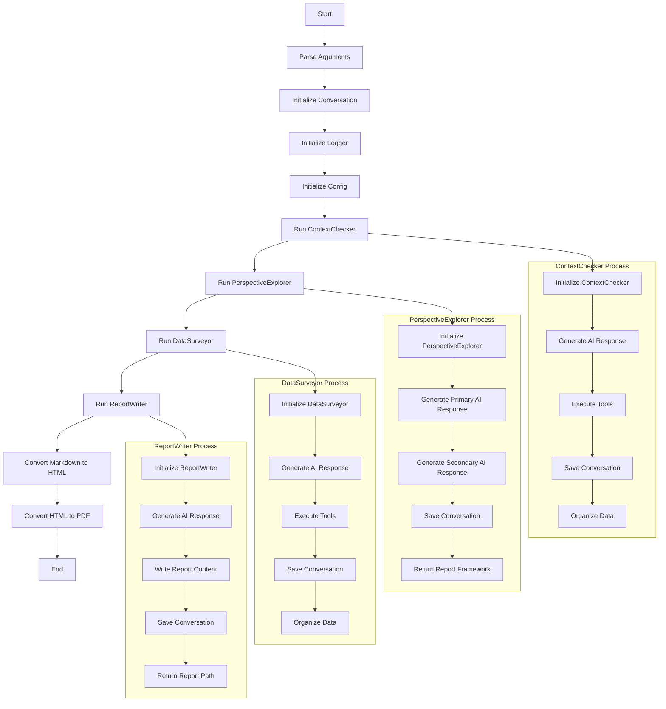

# Bedrock Tooluse Reporter - Class Diagram

## Main Components

```mermaid
classDiagram
    %% Main application flow
    class main {
        +main()
    }
    
    %% Core research classes
    class BaseReporter {
        -timestamp_str: str
        -conversation_count: int
        -config: Config
        -requested_tools: list
        -logger: DualLogger
        -conversation: Conversation
        -report_dir: str
        -tools: Tools
        -bedrock_runtime: BedrockModel
        -iterate_count: int
        -messages: list
        -system_prompt: str
        -max_iterate_count: int
        -is_finished: bool
        +__init__(timestamp_str, logger, conversation, user_prompt, requested_tools, mode, max_iterate_count)
        -_set_report_dir(): str
        -_define_system_prompt(): str
        -_initialize_messages(user_prompt): list
        -_set_tool_result_message(tool_result, tool_use_id): dict
        -_set_messages(assistant_message, tool_result_message): list
        +generate_response(model_id): dict
        +run(): Any
    }
    
    class ContextChecker {
        +__init__(timestamp_str, logger, conversation, user_prompt, requested_tools, mode, max_iterate_count)
        -_define_system_prompt(): str
        -_organize_data(data): str
        +run(): str
    }
    
    class PerspectiveExplorer {
        -timestamp_str: str
        -perspective_explorer_count: int
        -config: Config
        -logger: DualLogger
        -conversation: Conversation
        -bedrock_runtime: BedrockModel
        -max_perspective_explorer_count: int
        -context_check_result: str
        -messages: dict
        -system_prompt: str
        +__init__(timestamp_str, logger, conversation, user_prompt, mode)
        -_define_system_prompt(): str
        -_initialize_messages(user_prompt): dict
        -_set_context_check_result(): str
        +generate_response(model_id, is_primary): dict
        -_remove_reasoning(message): tuple
        +run(): str
    }
    
    class DataSurveyor {
        +__init__(timestamp_str, logger, conversation, user_prompt, requested_tools, mode, max_iterate_count)
        -_define_system_prompt(): str
        -_organize_data(data): str
        +run(): dict
    }
    
    class ReportWriter {
        -mermaid_description: str
        +__init__(timestamp_str, logger, conversation, user_prompt, requested_tools, mode, max_iterate_count)
        -_set_mermaid_description(): str
        -_define_system_prompt(): str
        +run(): str
    }
    
    %% Utility classes
    class Config {
        +BEDROCK: dict
        +MAX_CONTEXT_CHECK_COUNT: int
        +MAX_PERSPECTIVE_EXPLORER_COUNT: int
        +MAX_DATA_SURVEYOR_COUNT: int
        +REPORT_DIR: str
        +CONVERSATION_DIR: str
        +LOG_DIR: str
        +CONTEXT_CHECK_REQUESTED_TOOLS: list
        +DATA_SURVEYOR_REQUESTED_TOOLS: list
        +REPORT_WRITER_REQUESTED_TOOLS: list
        +IMAGE_CONFIG: dict
        +DOCUMENT_CONFIG: dict
        +__init__(mode)
    }
    
    class Conversation {
        -resume_file: str
        -timestamp_str: str
        -conversation_file: str
        -conversation: dict
        -resume: bool
        +__init__(resume_file)
        -_set_conversation_file(): str
        -_load_conversation(): dict
        +save_conversation(name, messages)
    }
    
    class DualLogger {
        -VALID_LOG_LEVELS: dict
        -logger: Logger
        +__init__(timestamp_str, log_level)
        +set_level(log_level)
        +debug(message)
        +info(message)
        +warning(message)
        +error(message)
        +critical(message)
    }
    
    class BedrockModel {
        -client: boto3.client
        -config: Config
        -max_retries: int
        -base_delay: int
        -max_delay: int
        -logger: DualLogger
        +__init__(logger, mode)
        -_exponential_backoff(retry_count): float
        -_execute_with_retry(**kwargs): dict
        +generate_response(model_id, messages, system_prompt, inference_config, tool_config): dict
        +describe_document(document_content, document_name, document_type, model_id): str
        +describe_html(content, model_id): str
    }
    
    class BedrockModelWrapper {
        -max_retries: int
        -base_delay: int
        -max_delay: int
        -logger: DualLogger
        -profiles: list
        -clients: dict
        -current_profile_index: int
        -profile_lock: Lock
        +__init__(logger)
        -_get_next_client(): tuple
        -_execute_with_retry(**kwargs): dict
    }
    
    class Tools {
        -logger: DualLogger
        -requested_tools: list
        -tool_config: dict
        -timestamp_str: str
        -api_key: str
        -search_url: str
        -image_search_url: str
        -headers: dict
        -timeout: tuple
        -config: Config
        -report_dir: str
        -image_dir: str
        -bedrock: BedrockModel
        +__init__(timestamp_str, logger, requested_tools, mode, report_dir)
        -_set_image_dir(): str
        +get_tool_config(): dict
        -_load_api_key(file_path): str
        -_get_http_headers(): dict
        -_extract_info(data): list
        +search(query): str
        -_process_document(url, document_type): str
        +get_content(url): str
        +image_search(query, max_results): str
        -_download_and_save_image(url, ext): str
        +write(content, write_file_path): str
    }
    
    %% Relationships
    main --> ContextChecker: uses
    main --> PerspectiveExplorer: uses
    main --> DataSurveyor: uses
    main --> ReportWriter: uses
    
    BaseReporter <|-- ContextChecker: extends
    BaseReporter <|-- DataSurveyor: extends
    BaseReporter <|-- ReportWriter: extends
    
    BaseReporter --> Config: uses
    BaseReporter --> DualLogger: uses
    BaseReporter --> Conversation: uses
    BaseReporter --> Tools: uses
    BaseReporter --> BedrockModel: uses
    
    PerspectiveExplorer --> Config: uses
    PerspectiveExplorer --> DualLogger: uses
    PerspectiveExplorer --> Conversation: uses
    PerspectiveExplorer --> BedrockModel: uses
    
    Tools --> BedrockModel: uses
    Tools --> Config: uses
    
    BedrockModel <|-- BedrockModelWrapper: extends
```

## Utility Functions

```mermaid
classDiagram
    class utils {
        +parse_arguments(): argparse.Namespace
        +md2html(report_markdown_path, logger): str
        +html2pdf(report_html_path, logger): str
    }
```

## Process Flow

```mermaid
flowchart TD
    A[Start] --> B[Parse Arguments]
    B --> C[Initialize Conversation]
    C --> D[Initialize Logger]
    D --> E[Initialize Config]
    
    E --> F[Run ContextChecker]
    F --> G[Run PerspectiveExplorer]
    G --> H[Run DataSurveyor]
    H --> I[Run ReportWriter]
    
    I --> J[Convert Markdown to HTML]
    J --> K[Convert HTML to PDF]
    K --> L[End]
    
    subgraph "ContextChecker Process"
    F1[Initialize ContextChecker] --> F2[Generate AI Response]
    F2 --> F3[Execute Tools]
    F3 --> F4[Save Conversation]
    F4 --> F5[Organize Data]
    end
    
    subgraph "PerspectiveExplorer Process"
    G1[Initialize PerspectiveExplorer] --> G2[Generate Primary AI Response]
    G2 --> G3[Generate Secondary AI Response]
    G3 --> G4[Save Conversation]
    G4 --> G5[Return Report Framework]
    end
    
    subgraph "DataSurveyor Process"
    H1[Initialize DataSurveyor] --> H2[Generate AI Response]
    H2 --> H3[Execute Tools]
    H3 --> H4[Save Conversation]
    H4 --> H5[Organize Data]
    end
    
    subgraph "ReportWriter Process"
    I1[Initialize ReportWriter] --> I2[Generate AI Response]
    I2 --> I3[Write Report Content]
    I3 --> I4[Save Conversation]
    I4 --> I5[Return Report Path]
    end
    
    F --> F1
    G --> G1
    H --> H1
    I --> I1
```
