# mermaid test
## Flowchart
Flowchart は、プロセスやワークフローの流れを視覚的に表現するために使用される図です。アルゴリズムの設計、業務プロセスの文書化、または意思決定の流れを示す場合に最適です。矢印で接続されたノードを使用して、ステップバイステップの進行を明確に表現できます。

例えば、ソフトウェア開発においては、ユーザー入力の検証プロセスや、バグ修正のワークフローを図示するのに役立ちます。

しかし、Flowchart は意外にも日常生活の計画にも流用することができます。朝の準備ルーティン、休暇の計画、さらには料理のレシピを視覚化するのにも使えます。特に複雑な決断が必要な状況（「雨が降っていたら傘を持っていく、そうでなければ日焼け止めを塗る」など）を整理するのに便利です。また、子どもに論理的思考を教える教育ツールとしても活用できます。

以下は例です。
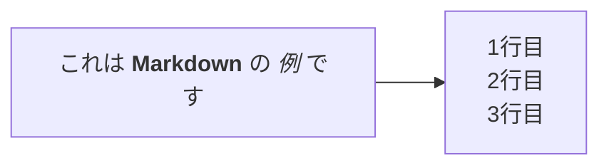

## Sequence Diagram
Sequence Diagram は、オブジェクト間の相互作用を時系列で表現するために使用される図です。特にソフトウェア設計において、システムコンポーネント間のメッセージのやり取りや処理の順序を明確に示すのに最適です。縦軸に時間の流れ、横軸に異なるオブジェクトやアクターを配置することで、複雑な相互作用を理解しやすく表現できます。

例えば、ウェブアプリケーションでユーザーがログインしてから特定の機能を使用するまでの一連の通信フローや、マイクロサービスアーキテクチャにおけるサービス間の呼び出し順序を文書化するのに役立ちます。

しかし、Sequence Diagram は技術的な用途だけでなく、日常のコミュニケーションパターンを分析するのにも流用することができます。例えば、会議の効率性を向上させるために参加者間の対話の流れを視覚化したり、カスタマーサービスのシナリオを改善するために顧客と複数の部門間のやり取りを図示したりすることができます。また、映画やドラマのシーン分析で登場人物間の会話の流れを表現するという創造的な使い方も可能です。複雑な社会的相互作用を理解するための教育ツールとしても意外と効果的です。

以下は例です。
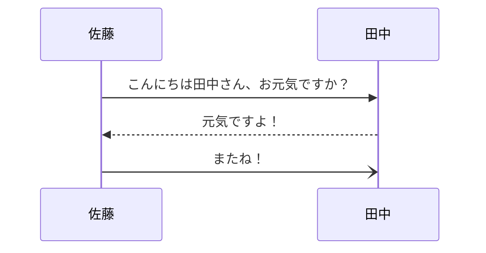

## Class Diagram
Class Diagram は、システムの静的構造を表現するために使用される図で、オブジェクト指向設計において中心的な役割を果たします。クラス、その属性、メソッド、および他のクラスとの関係（継承、集約、関連など）を視覚化するのに最適です。ソフトウェアアーキテクチャの設計段階でシステムの構造を明確にしたり、既存のコードベースを文書化したりする際に非常に役立ちます。

例えば、新しいアプリケーションを開発する際のドメインモデルの設計や、フレームワークの構造を理解するためのリバースエンジニアリングに使用されます。

しかし、Class Diagram は純粋なソフトウェア設計以外にも流用することができます。例えば、組織構造や役割の関係性を表現するのに使うことができ、部門間の責任分担や報告ラインを明確にするのに役立ちます。また、家系図のような家族関係の表現や、生物学における分類体系の視覚化にも応用できます。さらに、図書館の書籍分類システムや、製品カテゴリの階層構造を設計する際にも、Class Diagram の考え方が活かせます。このように、関係性と属性を持つ任意のエンティティ群を構造化する必要がある場面で、意外と汎用的に使えるツールです。

以下は例です。
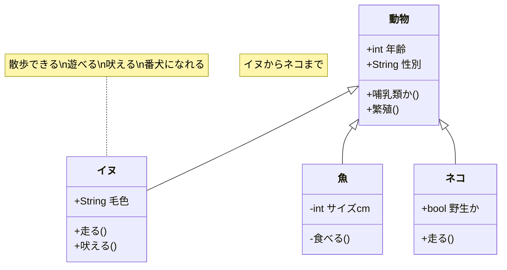

## State Diagram
State Diagram は、オブジェクトやシステムの状態遷移を視覚化するために使用される図です。システムが取りうる様々な状態と、ある状態から別の状態へ移行するためのトリガーとなるイベントや条件を明確に表現するのに最適です。特に有限状態機械（FSM）の設計やモデリングにおいて重要な役割を果たします。

例えば、ユーザー認証システムの状態（未認証、認証中、認証済み、エラー状態など）や、注文処理システムのライフサイクル（注文作成、支払い待ち、発送準備中、発送済みなど）を表現するのに使われます。

しかし、State Diagram はソフトウェアやシステム設計以外にも流用することができます。例えば、人間の感情や心理状態の変化を表現するのに使うことができ、カスタマージャーニーマップの作成や、ユーザー体験のモデリングに役立ちます。また、プロジェクト管理において、タスクの状態遷移（未着手、進行中、レビュー中、完了など）を視覚化したり、法的手続きの流れを説明したりするのにも応用できます。さらに、ゲームデザインにおいてキャラクターの行動パターンやゲームのルール設計にも活用できる、意外と汎用性の高い図です。

以下は例です。
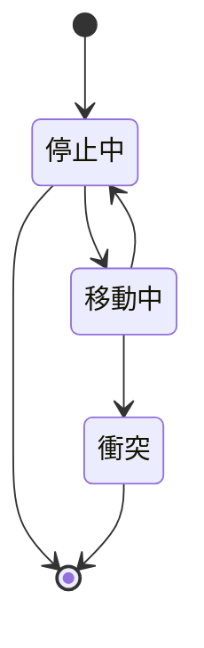

## Entity Relationship Diagram
Entity Relationship Diagram (ERD) は、データベース設計において、データモデルの構造を視覚化するために使用される図です。エンティティ（テーブル）、その属性（列）、およびエンティティ間の関係（一対一、一対多、多対多など）を明確に表現するのに最適です。データベースの設計段階でスキーマを計画したり、既存のデータベース構造を文書化したりする際に非常に役立ちます。

例えば、オンラインショッピングシステムのデータベース設計では、顧客、商品、注文などのエンティティとそれらの関係性を ERD で表現することで、効率的なデータ構造を設計できます。

しかし、ERD はデータベース設計以外にも流用することができます。例えば、組織内の部門間の情報の流れや依存関係を視覚化するのに使うことができ、業務プロセスの最適化に役立ちます。また、研究プロジェクトにおける概念間の関係性のマッピングや、複雑な物語の登場人物間の関係図の作成にも応用できます。さらに、家系図や社会的ネットワークの分析、イベント計画における資源と責任の割り当てなど、関係性を持つ任意の要素群を構造化する必要がある場面で、意外と汎用的に活用できるツールです。

以下は例です。
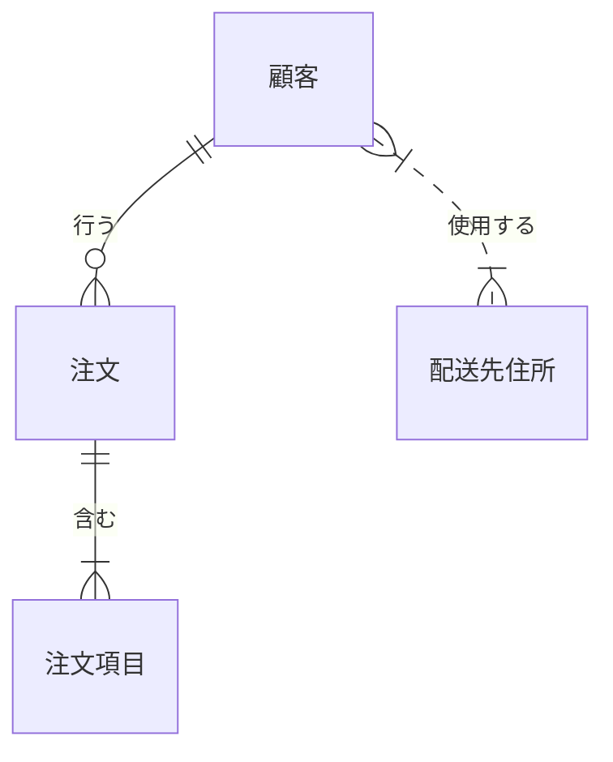

## User Journey Diagram
User Journey Diagram は、ユーザーがサービスやプロダクトとどのように相互作用するかを時系列で視覚化するために使用される図です。ユーザーの行動、感情、タッチポイント、痛点などを含む体験の全体像を表現するのに最適です。UXデザインプロセスにおいて、ユーザー体験を改善するための洞察を得たり、チーム間でユーザーの視点を共有したりする際に非常に役立ちます。

例えば、eコマースサイトでの購入プロセスや、モバイルアプリのオンボーディング体験など、ユーザーの一連の行動と感情の変化を図示することで、改善すべき点を特定できます。

しかし、User Journey Diagram はデジタルプロダクト設計以外にも流用することができます。例えば、患者の医療体験を改善するために病院内の患者の流れを視覚化したり、観光地での訪問者の経路と体験を最適化するために使ったりすることができます。また、従業員のオンボーディングプロセスの設計や、イベント参加者の体験設計にも応用できます。さらに、教育カリキュラムの設計において学習者の成長過程を視覚化したり、長期的な顧客関係の構築プロセスを計画したりするのにも役立つ、意外と汎用性の高い図です。

以下は例です。
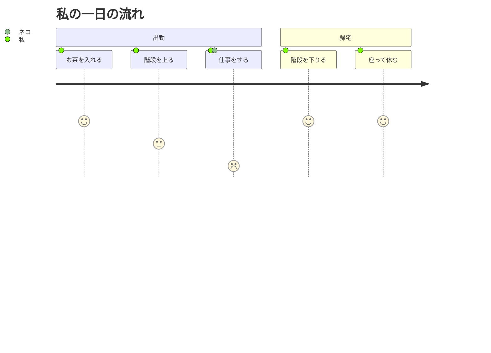

## Gantt
Gantt Chart は、プロジェクト管理において、タスクのスケジュールと進捗状況を時系列で視覚化するために使用される図です。横軸に時間、縦軸にタスクを配置し、各タスクの開始日、終了日、期間を水平バーで表現するのに最適です。タスク間の依存関係や、マイルストーン、クリティカルパスなども表示できるため、プロジェクトの計画立案や進捗管理に非常に役立ちます。

例えば、ソフトウェア開発プロジェクトの各フェーズのスケジュール管理や、建設プロジェクトの工程管理など、複数のタスクが並行して進む複雑なプロジェクトの可視化に使われます。

しかし、Gantt Chart はビジネスプロジェクト以外にも流用することができます。例えば、個人の学習計画や資格取得のためのロードマップを視覚化するのに使うことができ、長期的な目標達成をサポートします。また、家族の休暇計画や引っ越しの段取り、結婚式の準備など、プライベートな予定管理にも応用できます。さらに、料理の段取り（特に複数の料理を同時に準備する場合）や、ガーデニングの年間計画、フィットネス目標の達成計画など、時間軸に沿った活動の管理が必要な日常的なシーンでも、意外と実用的に活用できるツールです。

以下は例です。
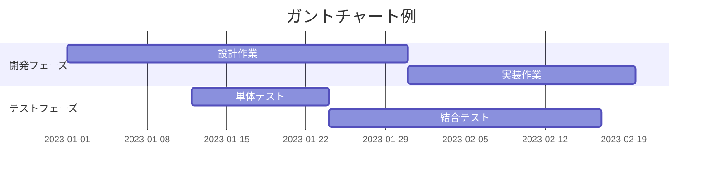

## Pie Chart
Pie Chart は、全体に対する部分の割合や構成比を円形のグラフで視覚化するために使用される図です。円を扇形のセグメントに分割し、各セグメントの大きさがそれぞれの項目の比率を表現するのに最適です。データの分布や構成を一目で把握しやすく、特に全体に対する相対的な大きさを強調したい場合に役立ちます。

例えば、予算配分の内訳、市場シェア、アンケート結果の分析など、全体を構成する要素の比率を示す場面でよく使われます。

しかし、Pie Chart は伝統的なデータ可視化以外にも流用することができます。例えば、時間管理において一日の活動配分を視覚化するのに使うことができ、生産性向上や生活バランスの改善に役立ちます。また、食事の栄養バランス（タンパク質、炭水化物、脂質などの割合）の表現や、パーソナルファイナンスにおける支出カテゴリの分析にも応用できます。さらに、チームプロジェクトでの作業分担の可視化や、子どもへの分数や割合の概念の教育ツールとしても活用できる、意外と日常生活に取り入れやすい図です。また、色彩設計においてカラーパレットの構成比を示したり、ガーデニングで花壇のカラーバランスを計画したりするような創造的な用途にも使えます。

以下は例です。
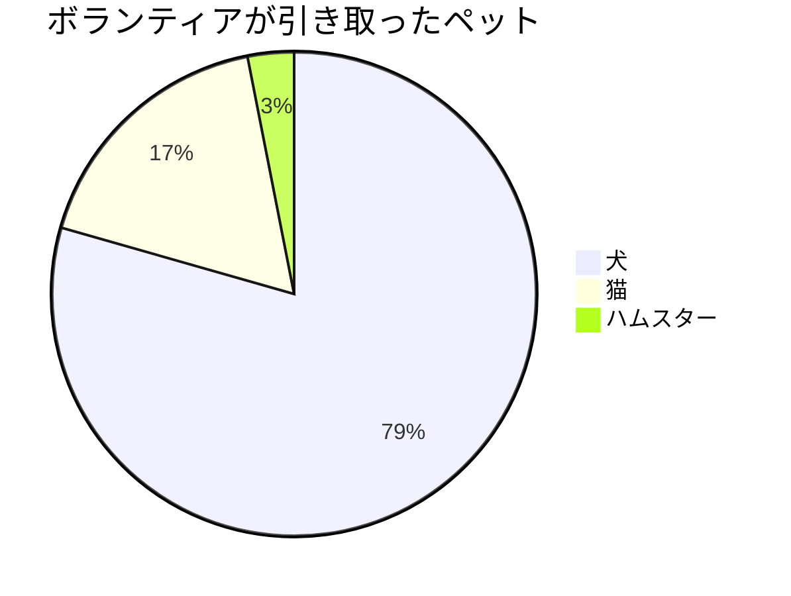

## Quadrant Chart
Quadrant Chart は、2つの軸で区切られた4つの象限にデータポイントをプロットして、項目間の関係性や分布を視覚化するために使用される図です。2つの変数に基づいてアイテムを分類・評価し、戦略的な意思決定を支援するのに最適です。特に優先順位付けや位置づけを明確にしたい場合に役立ちます。

例えば、ビジネス戦略においてはSWOT分析（強み、弱み、機会、脅威）の表現や、製品ポートフォリオ管理におけるBCGマトリックス（市場成長率と相対的市場シェアに基づく分類）などに使われます。

しかし、Quadrant Chart はビジネス分析以外にも流用することができます。例えば、個人の時間管理において「緊急度と重要度」に基づくタスクの整理（アイゼンハワーマトリックス）に使うことができ、生産性向上に役立ちます。また、住居や学校選びの際に「コストと利便性」などの軸で選択肢を比較したり、食材や料理を「健康度と満足度」で分類したりするのにも応用できます。さらに、人間関係の整理（親密さと信頼度など）や、趣味の活動選択（楽しさと成長性など）、読書計画（読みやすさと学びの深さなど）といった個人的な意思決定にも活用できる、意外と日常生活に取り入れやすい図です。

以下は例です。
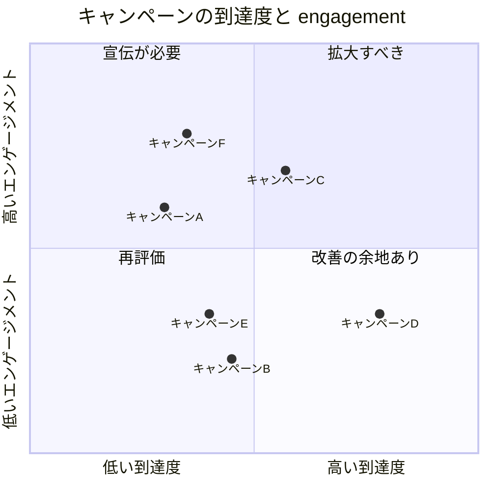

## Requirement Diagram
Requirement Diagram は、システム要件とその関係性を視覚化するために使用される図です。機能要件、非機能要件、制約条件などを階層的に整理し、要件間の依存関係や派生関係を明確に表現するのに最適です。特にシステム開発の初期段階で、ステークホルダーの期待を構造化し、開発チームと共有する際に役立ちます。

例えば、ソフトウェア開発プロジェクトにおいて、ユーザーストーリーから導出された要件の関連性を示したり、複雑なシステムの機能要件と非機能要件（セキュリティ、パフォーマンス、ユーザビリティなど）の関係を整理したりするのに使われます。

しかし、Requirement Diagram はソフトウェア開発以外にも流用することができます。例えば、個人の目標設定において、大きな目標とそれを達成するための小さな要件を構造化するのに使うことができ、自己啓発や成長計画に役立ちます。また、イベント計画での必要事項の整理や、家の改装プロジェクトでの要望と制約の関係性の明確化にも応用できます。さらに、教育カリキュラムの設計において学習目標と前提知識の関係を視覚化したり、複雑な料理レシピの材料と手順の依存関係を整理したりするのにも活用できる、意外と日常的な計画立案にも使える図です。

以下は例です。
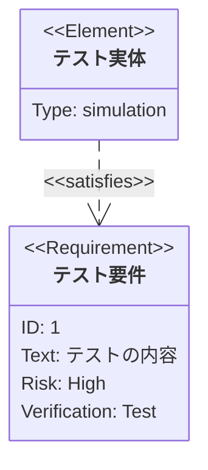

## Git Diagram
Git Diagram は、バージョン管理システムにおけるコミット履歴、ブランチ、マージの関係性を視覚化するために使用される図です。開発の流れやコードの変更履歴を時系列で表現し、複数の開発ラインがどのように分岐・統合されているかを明確に示すのに最適です。特にチーム開発において、ブランチ戦略の計画や、複雑なマージ作業の理解を助けるのに役立ちます。

例えば、GitFlowやGitHub Flowなどのブランチング戦略の説明や、リリース履歴の文書化、問題が発生したコミットの特定などに使われます。

しかし、Git Diagram はソフトウェア開発以外にも流用することができます。例えば、文書作成の改訂履歴を視覚化するのに使うことができ、論文や契約書などの重要文書の変更管理に役立ちます。また、プロジェクトの意思決定の流れや、組織の方針変更の歴史を時系列で表現するのにも応用できます。さらに、家系図における家族の分岐と統合の表現や、料理レシピの派生関係（基本レシピからのバリエーション）、小説や脚本の代替プロットラインの検討など、分岐と統合のパターンを持つ様々な創造的プロセスの管理にも活用できる、意外と汎用性の高い図です。

以下は例です。
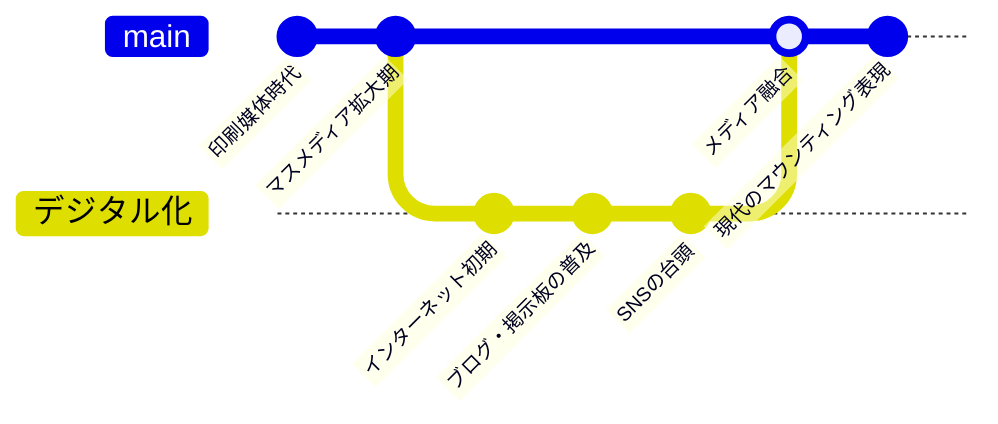

## C4 Diagram
C4 Diagram は、ソフトウェアアーキテクチャを異なる抽象化レベル（Context, Container, Component, Code）で視覚化するために使用される図です。システム全体から詳細な実装まで、段階的に掘り下げて表現することで、複雑なソフトウェアシステムの構造を理解しやすく伝えるのに最適です。特に技術的背景が異なるステークホルダー間でのコミュニケーションを促進し、アーキテクチャの意思決定を明確に文書化するのに役立ちます。

例えば、新しいシステムの設計を説明する際や、既存システムのリファクタリング計画を立てる場合、またはチームの新メンバーにシステム構造を効率的に理解させる場面で使われます。

しかし、C4 Diagram はソフトウェアアーキテクチャ以外にも流用することができます。例えば、組織構造を異なる詳細レベルで表現するのに使うことができ、会社全体から部門、チーム、個人の役割まで階層的に示すことで組織の理解を深めるのに役立ちます。また、複雑なプロジェクト計画の階層的な分解や、教育カリキュラムの構造化（コース全体から単元、レッスン、具体的な学習活動まで）にも応用できます。さらに、複雑な料理のレシピを全体像から具体的な手順まで段階的に説明したり、家の設計を建物全体から部屋、設備、細部の仕様まで階層的に表現したりするなど、複雑な構造を持つ様々な対象の理解を助ける手段として、意外と幅広く活用できる図です。

以下は例です。
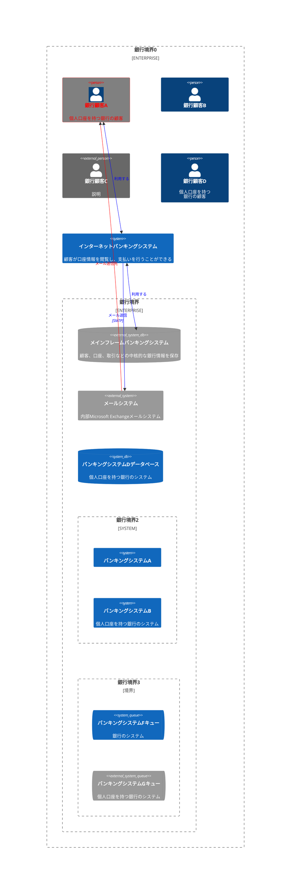

## Mindmap
Mindmap（マインドマップ）は、中心となるアイデアから放射状に関連する概念を広げていく形で情報を視覚化するために使用される図です。階層的な構造と関連性を自由な形式で表現し、アイデアの整理や発想の展開を促進するのに最適です。特にブレインストーミングやノート取り、知識の整理において、思考の流れを自然に反映させることができます。

例えば、プロジェクトの計画立案、会議の議事録作成、学習内容の整理、プレゼンテーションの構成などに使われます。

しかし、Mindmap は伝統的な用途以外にも流用することができます。例えば、個人の人生設計やキャリアプランを視覚化するのに使うことができ、目標と必要なステップの関連性を明確にするのに役立ちます。また、旅行計画の立案（訪問地、アクティビティ、宿泊、交通手段など）や、料理のレシピ開発（材料、調理法、バリエーションなど）にも応用できます。さらに、贈り物のアイデア出し、読書感想の整理、家族の思い出の記録など、日常生活のあらゆる場面で創造的な思考を助けるツールとして活用できます。特に子どもの学習支援や、高齢者の記憶力維持のための認知トレーニングとしても効果的で、意外と幅広い年齢層に役立つ図です。

以下は例です。
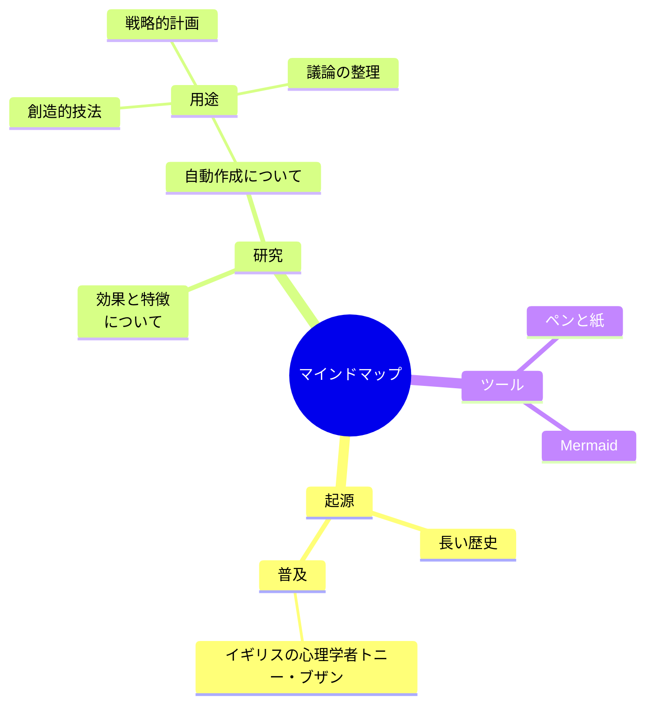

## Timeline
Timeline（タイムライン）は、出来事や活動を時間軸に沿って順序立てて視覚化するために使用される図です。時系列に沿った情報を整理し、時間的な流れや進展を明確に表現するのに最適です。特に歴史的な出来事の記録や、プロジェクトの進捗状況の追跡において、時間の経過に伴う変化や発展を理解しやすく伝えるのに役立ちます。

例えば、企業の沿革、歴史的事件の年表、プロジェクトのマイルストーン、製品開発の過程などを表現するのによく使われます。

しかし、Timeline は伝統的な用途以外にも流用することができます。例えば、個人の成長記録や人生の重要な出来事を視覚化するのに使うことができ、自己理解や将来計画の立案に役立ちます。また、子どもの発達段階の記録や、健康状態の変化の追跡、習慣形成の過程の可視化にも応用できます。さらに、恋愛関係の発展過程、友情の歴史、家族の思い出の整理など、人間関係の深化を振り返るツールとしても活用できます。また、創作活動において物語のプロット展開を計画したり、料理の発酵や熟成プロセスを管理したりするなど、時間が重要な要素となる様々な活動に対して、意外と柔軟に活用できる図です。

以下は例です。
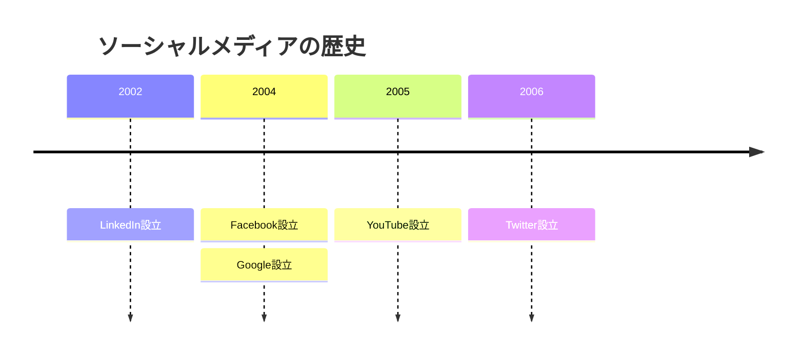

## ZenUML
ZenUML は、シーケンス図をテキストベースで簡潔に記述するために使用される表記法です。複雑なオブジェクト間の相互作用を、視覚的な図を直接描くことなく、テキスト形式で効率的に表現するのに最適です。特にソフトウェア開発において、システムコンポーネント間の通信フローやメッセージのやり取りを素早く文書化する際に役立ちます。

例えば、API設計の検討、マイクロサービス間の相互作用の定義、ユースケースシナリオの詳細化などに使われます。

しかし、ZenUML はソフトウェア設計以外にも流用することができます。例えば、会話の流れや対話のパターンを分析するのに使うことができ、効果的なコミュニケーション戦略の開発に役立ちます。また、カスタマーサービスのスクリプト作成や、営業トークの構造化、インタビュー計画の立案にも応用できます。さらに、演劇や映画の台本における登場人物間のやり取りの設計、教育シナリオでの教師と学生の対話パターンの計画、会議の進行シナリオの作成など、人と人との相互作用が重要な様々な場面で、テキストベースの簡潔な表現方法として、意外と実用的に活用できるツールです。

以下は例です。
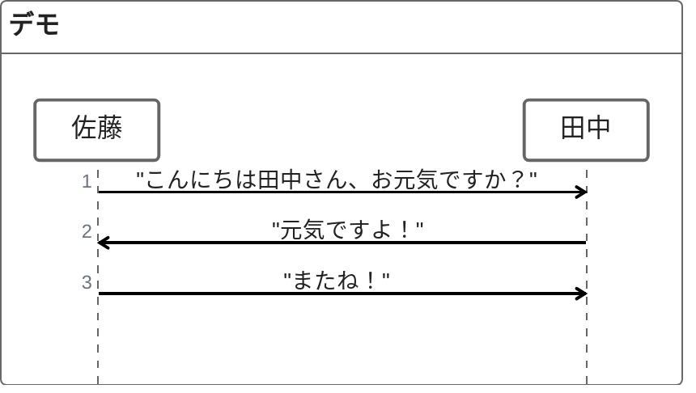

## Sankey Diagram
Sankey Diagram（サンキーダイアグラム）は、フローや移動量を視覚化するために使用される図です。ノード間を流れる量をその幅で表現し、複雑なシステム内の資源、エネルギー、材料、コストなどの流れを直感的に把握するのに最適です。特に入力から出力への変換過程や、異なるカテゴリ間の分配を量的に示す際に役立ちます。

例えば、エネルギーの生成と消費の分析、材料のサプライチェーン可視化、予算配分の追跡、ウェブサイトのユーザーフロー分析などに使われます。

しかし、Sankey Diagram は伝統的な用途以外にも流用することができます。例えば、個人の時間の使い方を視覚化するのに使うことができ、一日24時間がどのように様々な活動に配分されているかを明確にするのに役立ちます。また、食事の栄養素の摂取と消費のバランス、家計における収入と支出の流れ、人材の採用から退職までの流動性の分析にも応用できます。さらに、SNSでの情報拡散のパターン、家族内での家事分担の可視化、読書時間と読書ジャンルの関係性など、日常生活における様々な「流れ」や「配分」を理解するための洞察ツールとして、意外と身近な問題解決にも活用できる図です。

以下は例です。
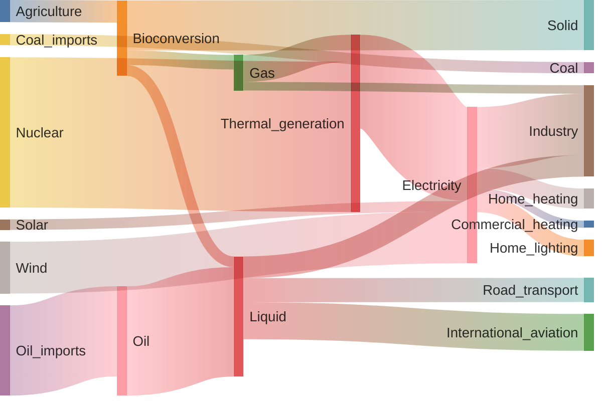

## XY Chart
XY Chart（XY図）は、2つの変数の関係性を二次元平面上にプロットして視覚化するために使用される図です。X軸とY軸に異なる変数を割り当て、データポイントの分布やパターンを明確に表現するのに最適です。特に変数間の相関関係、傾向、外れ値を識別する際に役立ちます。

例えば、科学研究における実験結果の分析、経済指標間の関係性の調査、マーケティングにおける価格と販売量の関係、製品のパフォーマンス評価などに使われます。

しかし、XY Chart は学術的・ビジネス的な用途以外にも流用することができます。例えば、個人の健康管理において運動量と体重変化の関係を追跡するのに使うことができ、効果的な健康目標の設定に役立ちます。また、学習時間と成績の関係分析、睡眠時間と生産性の相関、料理のレシピ調整（調理時間と温度の最適な組み合わせなど）にも応用できます。さらに、ガーデニングにおける植物の成長と水やりの頻度の関係、楽器の練習時間と上達度の追跡、家計における支出と満足度の関係など、日常生活における様々な「原因と結果」や「投入と産出」の関係を理解するための洞察ツールとして、意外と身近な意思決定にも活用できる図です。

以下は例です。
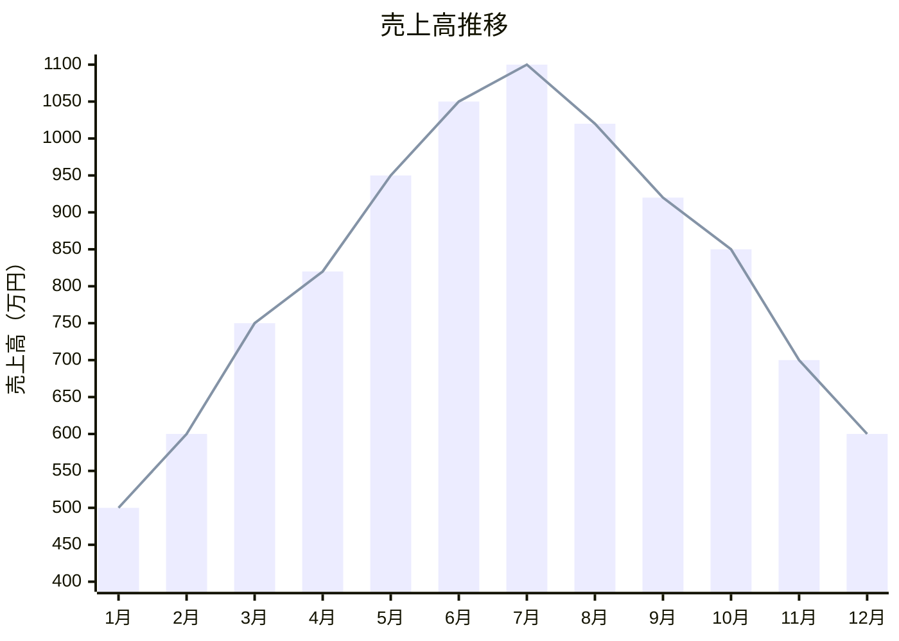
legend には対応していないことに注意してください。

## Block 
Block Diagram（ブロック図）は、システムの主要な部分とその相互接続を簡略化して視覚化するために使用される図です。複雑なシステムを機能的なブロックに分解し、それらの間の関係性や情報の流れを明確に表現するのに最適です。特にシステム設計の初期段階で、全体構造の概要を把握したり、コンポーネント間のインターフェースを定義したりする際に役立ちます。

例えば、電子回路の設計、制御システムのモデリング、信号処理の流れの説明、ソフトウェアアーキテクチャの概略表現などに使われます。

しかし、Block Diagram は工学的な用途以外にも流用することができます。例えば、組織構造や業務プロセスを視覚化するのに使うことができ、責任分担や情報の流れを明確にするのに役立ちます。また、イベント計画における各部門の役割と連携、家庭内の家事分担と協力体制の設計、学習カリキュラムの構成要素と関連性の表現にも応用できます。さらに、料理のワークフロー（前準備、調理、盛り付けなどの工程と並行作業）の計画、ガーデニングにおける植栽ゾーンの配置と水系統の設計、DIYプロジェクトの構成部品と組み立て順序の整理など、様々な計画立案や構造理解のシーンで、意外と日常的に活用できる図です。

以下は例です。
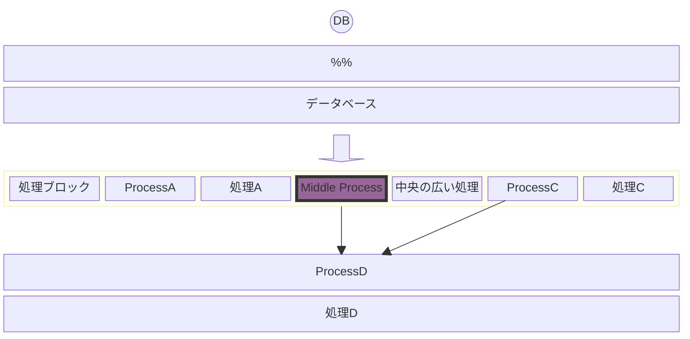

## Packet Diagram
Packet Diagram（パケット図）は、ネットワーク通信におけるデータパケットの構造や、プロトコルのフォーマットを視覚化するために使用される図です。データの各フィールドとそのビット/バイト配置を明確に表現し、プロトコルの仕様や通信データの構造を理解しやすく示すのに最適です。特にネットワークプロトコルの設計や、通信データの解析において、バイナリデータの論理的な構成を把握するのに役立ちます。

例えば、TCP/IPパケットの構造説明、カスタムプロトコルの設計、ネットワークトラブルシューティング、セキュリティ分析などに使われます。

しかし、Packet Diagram は純粋なネットワーク技術以外にも流用することができます。例えば、ファイル形式の構造を視覚化するのに使うことができ、データ保存形式の設計や解析に役立ちます。また、メモリレイアウトの設計、レコードやデータベーステーブルの構造表現、APIリクエスト/レスポンスのフォーマット定義にも応用できます。さらに、教育現場でのデータ構造の説明、法的文書や契約書の構成要素の整理、レシピの材料と分量の正確な表現など、構造化された情報を明確に伝える必要がある様々な場面で、意外と汎用的に活用できる図です。また、時間管理において一日のスケジュールを時間ブロックとして視覚化するという創造的な使い方も可能です。

以下は例です。
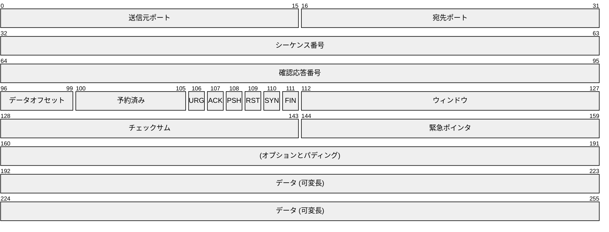

## Kanban Diagram
Kanban Diagram（カンバン図）は、作業の流れを視覚化し、タスクの進捗状況を管理するために使用される図です。「To Do」「In Progress」「Done」などの列にタスクカードを配置することで、作業の状態を一目で把握し、ワークフローを最適化するのに最適です。特にアジャイル開発やリーンマネジメントにおいて、作業の可視化、進行中の作業の制限、フローの管理を実現するのに役立ちます。

例えば、ソフトウェア開発プロジェクトのタスク管理、製品開発プロセスの追跡、チームの作業負荷のバランス調整などに使われます。

しかし、Kanban Diagram はプロジェクト管理以外にも流用することができます。例えば、家庭での家事分担を視覚化するのに使うことができ、家族全員の責任と進捗状況を明確にするのに役立ちます。また、個人の習慣形成や目標達成の追跡、学習プロセスの管理（「学習中」「復習が必要」「習得済み」など）にも応用できます。さらに、料理の準備工程の管理、引っ越しや大掃除の計画実行、読書リストの管理（「読みたい」「読んでいる」「読了」）など、日常生活における様々なタスクの整理と進捗管理に、意外と実用的に活用できる図です。また、子どもの家庭学習や宿題の管理ツールとしても効果的で、自己管理能力の育成にも役立ちます。

以下は例です。
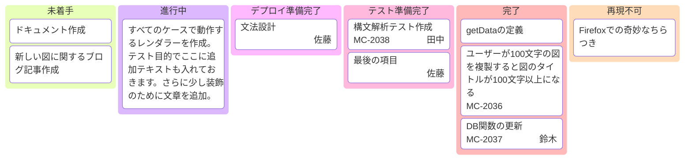

## Architecture Diagram
Architecture Diagram（アーキテクチャ図）は、システムの構造、コンポーネント、それらの関係性を包括的に視覚化するために使用される図です。システム全体の設計思想や構成要素を明確に表現し、技術的な意思決定や設計原則を伝えるのに最適です。特にソフトウェアやITインフラの設計において、複雑なシステムの全体像を把握し、ステークホルダー間で共通理解を形成するのに役立ちます。

例えば、クラウドインフラの設計、エンタープライズシステムの構成、マイクロサービスアーキテクチャの表現、セキュリティ設計の説明などに使われます。

しかし、Architecture Diagram は技術システム以外にも流用することができます。例えば、組織構造や業務プロセスの全体像を視覚化するのに使うことができ、部門間の関係性や情報の流れを明確にするのに役立ちます。また、教育カリキュラムの構造設計、イベント計画の全体像と各要素の関連性、研究プロジェクトの構成要素と方法論の関係にも応用できます。さらに、家の間取りと設備の関係性の計画、庭園のゾーニングとエレメントの配置、複雑な料理コースの構成と提供順序の設計など、様々な「システム」の構造化と可視化が必要な場面で、意外と創造的に活用できる図です。また、個人の知識体系やスキルセットの整理にも役立ち、キャリア開発の方向性を考える際の思考ツールとしても使えます。

以下は例です。
```mermaid
architecture-beta
    group api(cloud)[API]

    service db(database)[Database] in api
    service disk1(disk)[Storage] in api
    service disk2(disk)[Storage] in api
    service server(server)[Server] in api

    db:L -- R:server
    disk1:T -- B:server
    disk2:T -- B:db
```